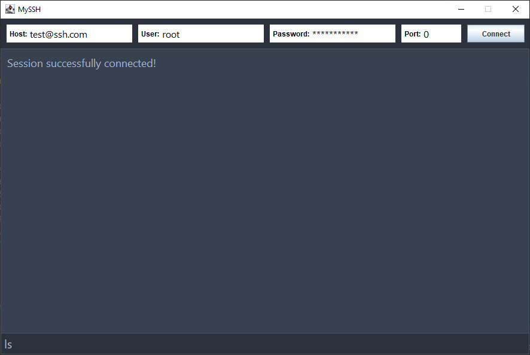

<!-- ABOUT THE PROJECT -->
## About The Project

I wanted to test myself and see if I could create a simple SSH wrapper using java. I have not had much previous experience working
with java UI frameworks so it sounded like a lot of fun. I ended up using JSCH to make the SSH connection easier on me. All in all I could have
made this look much better with ElectronJS but this does what it is supposed to.

 

  

### Built With

* [Java](https://www.oracle.com/)

<!-- CONTACT -->
## Contact

Author: Timothy Mickelson  
Email: tmickelson93@gmail.com
